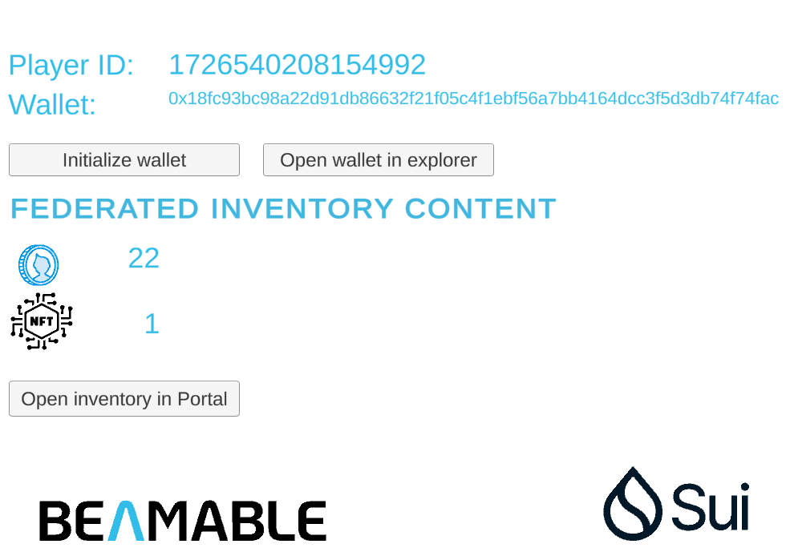

# Beamable SUI Sample

Welcome to the Beamable Sui Sample project that demonstrates how
to integrate the [Sui](https://sui.io/) services into a [Beamable](https://beamable.com/) powered game. We'll
use two Beamable federation features:

- [Federated Authentication](https://github.com/beamable/FederatedAuthentication) - use SUI non-custodial wallet or automatically 
  create one for each player
- [Federated Inventory](https://github.com/beamable/FederatedInventory) - mint NFTs for federated inventory items
  and FTs for federated inventory currency

## Requirements

Before getting started, please head to [Beamable](https://beamable.com/) to create required accounts.  
You should have the following tools installed on your development machine.

1. [Unity 2021+](https://unity.com/download)
2. [Docker](https://www.docker.com/products/docker-desktop/)
3. [.NET 6](https://dotnet.microsoft.com/en-us/download/dotnet/6.0)

### Configuration

Configuration defaults are hard-coded inside **Runtime/SuiFederation/Configuration.cs**  
You can override the values using the realm configuration.  


**Default values:**  
| **Namespace** | **Key**          |**Default value** |**Description**                                         |
|---------------|------------------|------------------|--------------------------------------------------------|
| federation_sui| SuiEnvironment   | devnet           | SUI network name (mainnet, testnet, devnet)            |  

**IMPORTANT:** Configuration is loaded when the service starts. Any configuration change requires a service restart.  

## Importing Into Your Project

The Sui integration is portable to other Beamable Unity projects. The Microservice and Microstorage code can be imported into a target project. The best way is to use Unity Package Manager and add a part of this repository as an external package.

**Before doing this, please ensure that the target project already has Beamable installed**

In the Unity Package Manager, [add a package via git-link](https://docs.unity3d.com/Manual/upm-ui-giturl.html).
for `com.beamable.sui` and use the following git-link.

```shell
https://github.com/beamable/sui-example-unity.git?path=/Packages/com.beamable.sui#1.0.0
```

## Sample Project

Once you have imported the package into your unity project, you can additionally import the sample scene via the Unity Package manager:


Alternatively, use `git` to clone this project, which has the sample pre-imported into `Assets/Samples`, and open it with Unity 2021 or later.

The `Demo` sample contains a scene called `Main` which allows you to easily initialize your wallet, view your inventory in game or in the portal, and view your wallet on sui scan:  


- Initialize wallet creates a current player custodial wallet whose address is then displayed
- Open inventory in portal opens the Beamable portal inventory page where you can grant federated items and currencies
  
- Open wallet in explorer opens SuiScan explorer showing players wallet and owned assets

## Federated content

This sample project includes one Sui federated item type - `blockchain_item` and one Sui federated currency type - `blockchain_currency`.  
You can enable federation on any content item of those types. Each item type has it's own set of default properties.  
Federated item properties:

- Name (NFT name)
- Url (NFT image url)
- Description (NFT description)  

Each NFT support additional custom metadata properties. Every property you specify in the Inventory `ItemCreateRequest` will become a NFT metadata property.  
Example `ItemCreateRequest`:

```json
{
  "contentId": "items.blockchain_item.shield",
  "properties": [
    {
      "name": "strength",
      "value": "5"
    }
  ]
}
```

Resulting metadata file:

```json
"items": {
  "items.blockchain_item.shield": [
      {
          "proxyId": "on-chain address",
          "properties": [
              {
                  "name": "Name",
                  "value": "shield name"
              },
              {
                  "name": "Description",
                  "value": "shield description"
              },
              {
                  "name": "Url",
                  "value": "shield image url"
              },
              {
                  "name": "strength",
                  "value": "5"
              }
          ]
      }
  ]
}
```

Federated currency properties:

- Name (FT name)
- Symbol (FT symbol, short currency symbol)
- Description (FT description)

## Contract generation

Smart contracts are generated in the microservice from the federated content. Project includes Sui CLI tool wrapped inside of the integration microservice to compile and deploy the smart contract to the destination Sui network defined in the Configuration. This process happens on the microservice startup.

## Sui SDK

This sample project includes Sui TypeScript SDK for all chain transactions. There is a cross language communication layer at `Runtime/SuiFederation/Features/SuiApi` that is responsible for invoking Sui TypeScript SDK functions.
Those include:

- wallet generation
- signature verification
- minting assets (FT-s and NFT-s)
- retrieving FT balance
- retrieving NFT information (owned assets and metadata)

## Try it out

- Specify target SuiEnvironment (sample project defaults to 'devnet')
- Define your federated NFT content under `blockchain_item` content type
- Define your federated FT content under `blockchain_currency` content type
- Publish the **SuiFederation** microservice along with the **SuiStorage** microstorage.
- When running with the 'devnet' or 'testnet' target SuiEnvironment, the microservice will automatically request some test SUI tokens used for contract deployment and transactions.
- On Sui 'mainnet' environment you will need to transfer SUI coins to realm account wallet before making transactions
- Realm account wallet address can be found by calling the microservice `GetRealmAccount` function 
- Open the Portal an wait for the microservice to get into the **running** state.
- Explore the microservice logs and microstorage data. Microservice should create and store your developer wallet and contracts on first run.

## Beamable SUI Sample project structure
Beamable SUI Sample project structure can be found [here](Packages/com.beamable.sui/Readme.md).